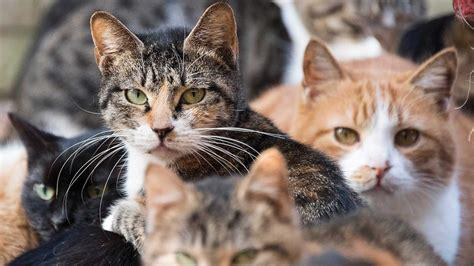
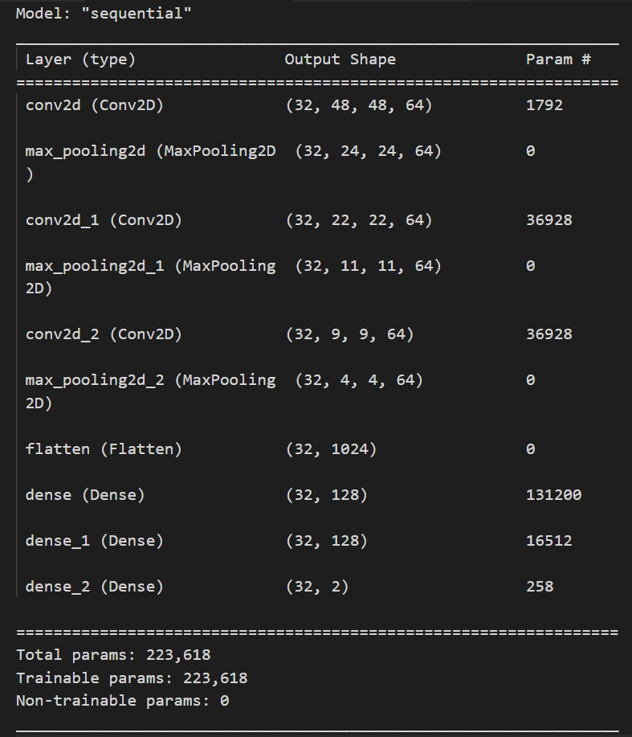

# ML Cohort

### Prerequisite - Task 1

1. Download the test images from this [Kaggle dataset](https://www.kaggle.com/mbkinaci/fruit-images-for-object-detection), and place them all in a folder
2. Define a function in the jupyter notebook to do the following tasks:

- **Input**:
  Takes the path of the folder as the input
   
- **Process**:
  Loads all the images and convert them to an array Convert all the images to grayscale images
   
- **Output**:
Number of images  Format type of the images Saving all the grayscale images to another folder
 
_Bonus_:
Convert the background of the images to white before converting them to grayscale
 

### Prerequisite - Task 2

<ol>
<li>Download the data from the <a href="https://drive.google.com/drive/folders/1KZ5sVLpEMqt4I4Yj3Sg8BAVJQ-5h9Nyw">link</a> here</li>
<li>Write a function in python script to do the following:

- Inputs: Input the folder name and csv filename through command line
- To-Do:</li>
 <ol>
 <li>Read all the images</li>
 <li>Read the csv file, and get the image label names and coordinates</li>
 <li>Draw the bounding boxes for every image, using the
corresponding image’s coordinates (Use different colour and
thickness for the bounding boxes)</li>
 <li>Add labels for every image (Use different font, font colour, font
size)</li>
 <li>Create another folder and save all the images to the folder</li>
 <li>Push the code to GitHub, and show few samples of the before and after on the Readme.md file</li>
</ol>
</ol>

##### Sample Input

##### Sample Output

 

### Prerequisite - Task 3

**AIM**: To create a neural network model of the highest accuracy, with the least number of parameters.  

<ol>
<li>Download the dataset from the <a href="https://drive.google.com/drive/folders/1AlztDRzHhuavHPb77o9ZDHGIp6za77AR">link</a> here</li>
<li>Create all the pre-processing steps similar to the one from the above notebooks</li>
<li>Create a Neural network model using Keras and train the model on the training dataset</li>
<li>Test the model on the test dataset</li>
<li>Push the code on Github, showing the model architecture, number of parameters and test accuracy on the Readme.md file.</li>
</ol>

#### Model Summary

 

#### Model Accuracy

